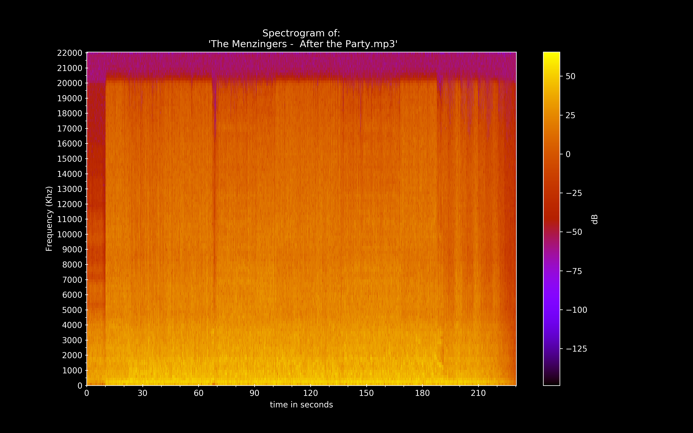

This shell script let's you create a

The script requires [ffmpeg](https://ffmpeg.org/) to be installed and requires the following Python libraries: numpy, matplotlib, wave. You can install these requirements by running:

`pip3 install -r requirements.txt`

It has been tested on Mac OSX 10.12.6.

Once installed, make sure to add the script to your path. After this, you can create a spectrogram from the command line by running:

`pyspec.py myAudioFile.mp3`

ffmpeg works with almost any audio file.

Screenshot:

